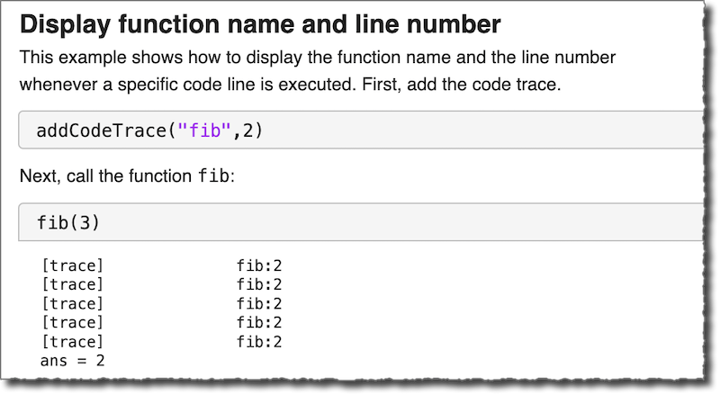

# Code Trace for MATLAB&reg;

[](https://www.mathworks.com/matlabcentral/fileexchange/118245-code-trace-for-matlab)

*Code Trace for MATLAB* is a collection of functions for creating and manipulating code traces, which can be used to help understand what is happening in code as it executes. A *code trace* prints a brief note to the MATLAB Command Window whenever a specific line of code is executed. A code trace might just print the function name and line number, or it might also print a label and the value of variable or expression.




## Basic Usage 

Call `addCodeTrace` with the name of a MATLAB function or script file and the line number that you want to trace:

```
addCodeTrace("myfunc",10)
```

Then, call your function as your normally would:

```
out = myfunc(input1,input2);
```

See the script GettingStarted.mlx, in the doc folder, for examples.

## Installation

*Code Trace for MATLAB* requires MATLAB release R2019b or newer.

Download the files to a folder on your computer, and place that folder on the [MATLAB Search Path](https://www.mathworks.com/help/matlab/matlab_env/what-is-the-matlab-search-path.html).

## License

The license is available in the License file within this repository.

## Community Support
[MATLAB Central](https://www.mathworks.com/matlabcentral)

Copyright 2022 The MathWorks, Inc.
